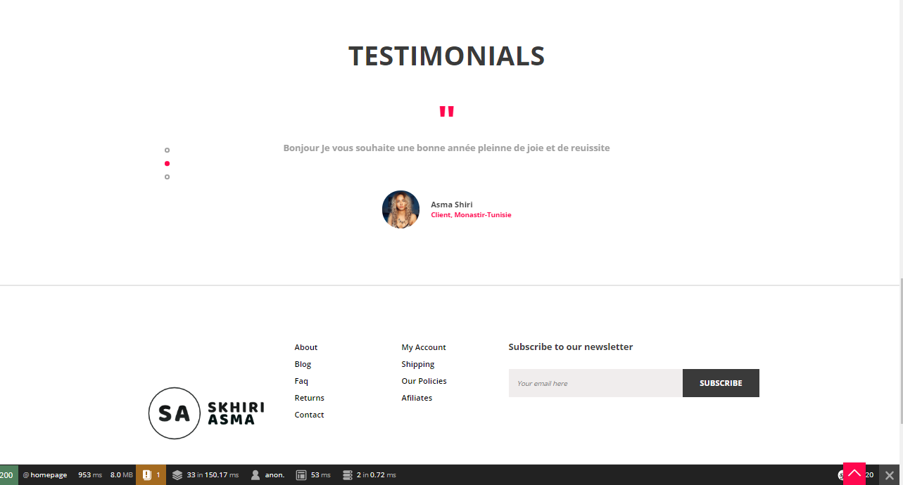
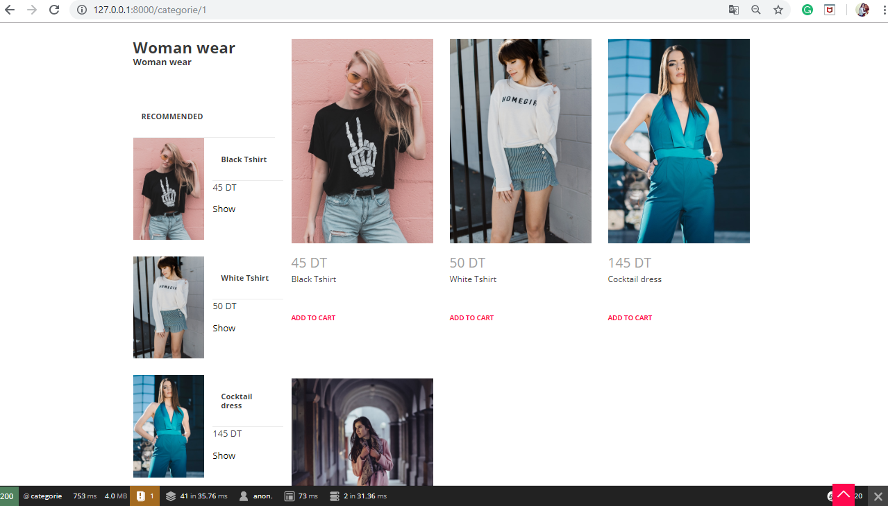
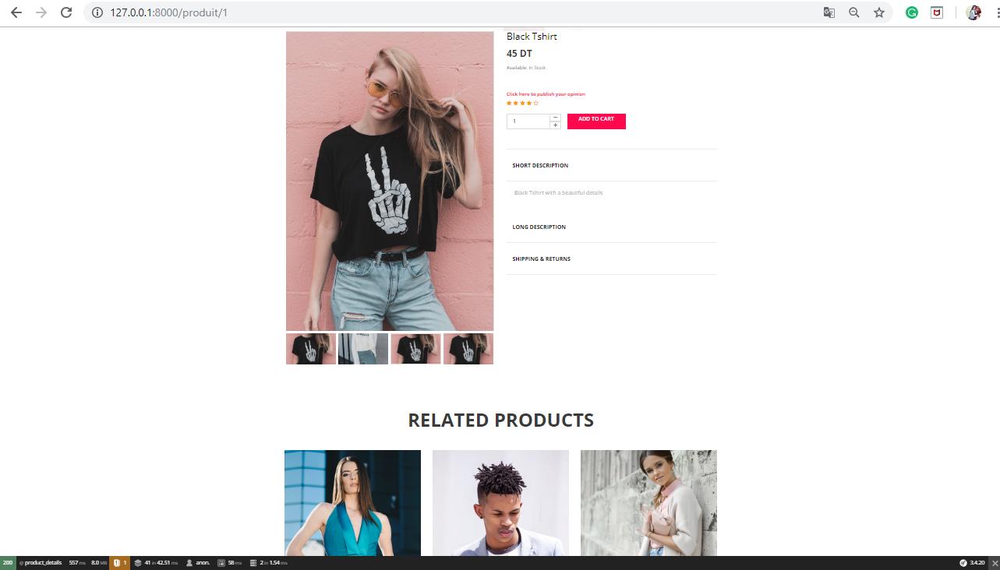
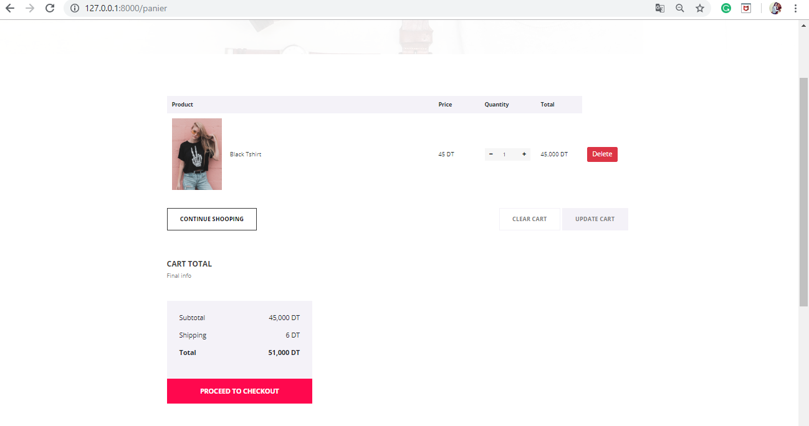
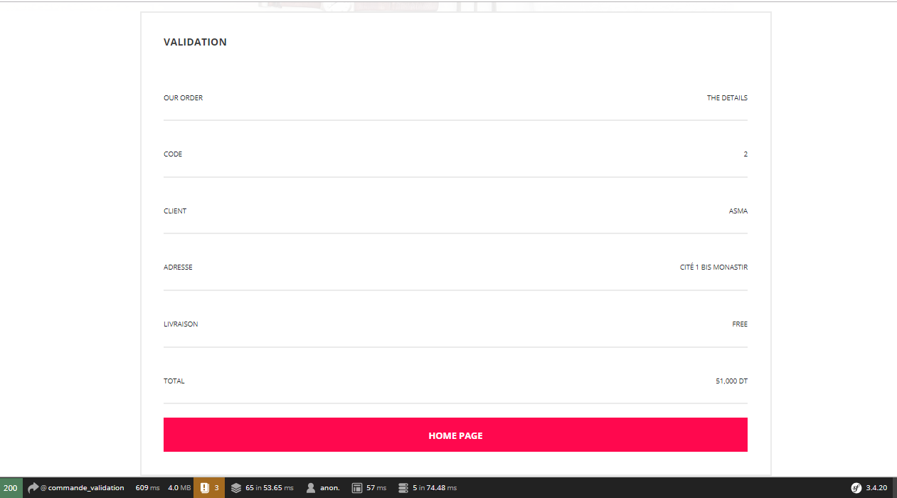
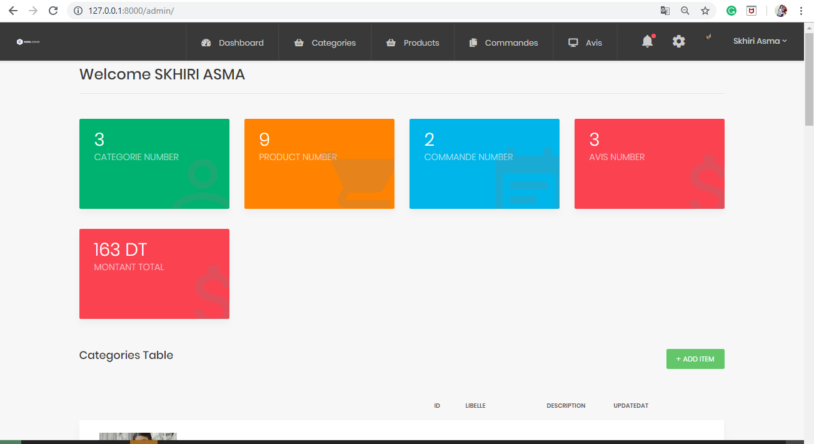
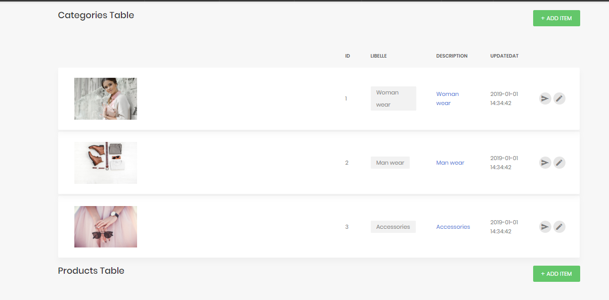
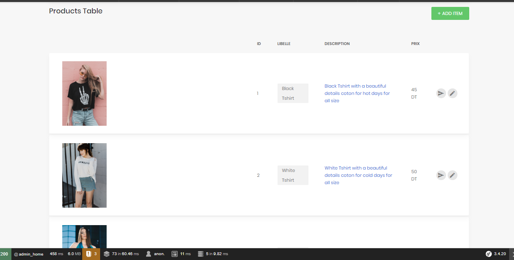
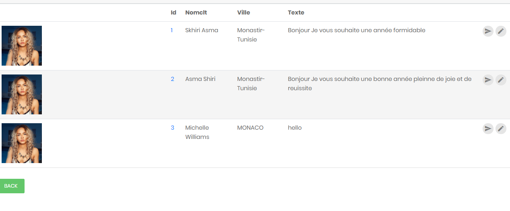

e_shop
======

A Symfony project created on December 28, 2018, 6:20 pm.

Lancer composer pour télécharger Symfony 3.4 
======

$ composer update

Créer la base de données 
======

$ php bin/console doctrine:database:create

Créer les tables 
======

$ php bin/console doctrine:schema:create

Charger les données (fixtures) 
======

php bin/console doctrine:fixtures:load

Démarrer le serveur 
======

$ php bin/console server:run

